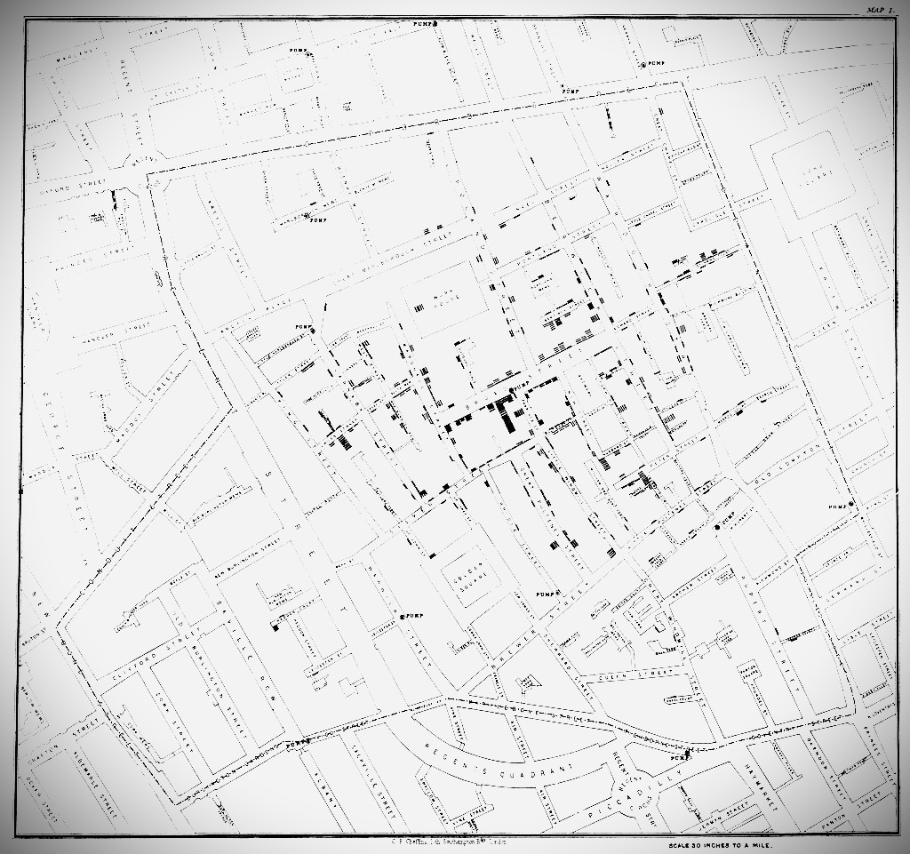

# John-Snow-Cholera-Map
A data-driven storytelling project recreating John Snow’s famous cholera map, built using scrolly-telling techniques.
This scrollytelling tells the story of John Snow with modern maps, a 19th-century British physician, widely regarded as one of the founders of modern epidemiology. During the 1854 cholera outbreak in London, most people believed cholera was spread through “bad air.” Snow challenged this idea. He mapped cholera cases in the Soho district and discovered that many victims lived near the Broad Street water pump. By removing the pump handle, he helped stop the outbreak. His work proved that cholera was transmitted through contaminated water, not air, and his use of data mapping became a landmark example of evidence-based public health.
The full project designed with ArcGIS can be seen [here](https://storymaps.arcgis.com/stories/1455171641734785ab23ca6a5b55b441).

